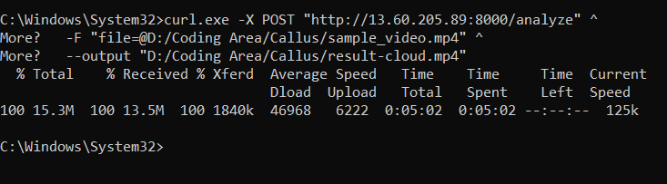

# Dance Movement Analyzer – Input & Output Demo

Below is a demonstration of the **input video**, the **cloud‑processed output video**, and a screenshot of the API call made to the AWS EC2 endpoint.

---

## 🎥 Sample Input Video  
This is the raw video uploaded to the FastAPI endpoint:

📌 **sample_video.mp4**  
[Click here to download](sample_video.mp4)

---

## 🎥 Cloud‑Processed Output Video  
This video was returned from the AWS EC2 Docker container running MediaPipe pose estimation:

📌 **result-cloud.mp4**  
[Click here to download](result-cloud.mp4)

---

## 🖼️ API Call Screenshot (curl Output)

This image shows the successful API call made from Windows PowerShell using `curl.exe`:

---

## 📌 How It Works  
1. The video is uploaded through the `/analyze` endpoint.  
2. The backend saves the video to `/tmp/...` inside the Docker container.  
3. MediaPipe Pose extracts body keypoints frame‑by‑frame.  
4. The system overlays the skeleton onto each frame.  
5. The processed video is returned to the user as `result-cloud.mp4`.

---

## ✅ Repository Includes  
- Full FastAPI backend  
- MediaPipe video processor  
- Dockerfile  
- Cloud deployment instructions  
- Unit tests  
- Demonstration videos (input + output)

---

## 🔗 Contact  
For any issues, improvements, or discussion, feel free to reach out.

